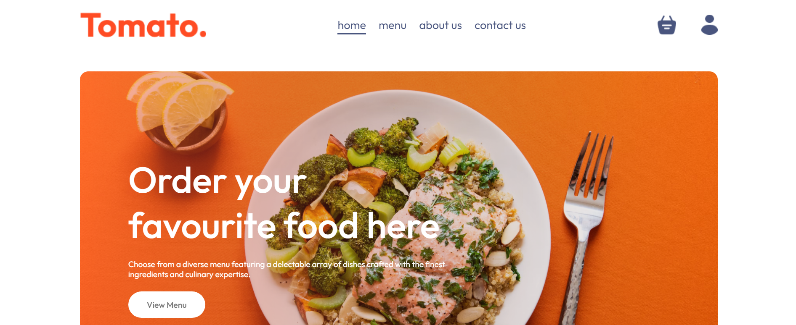
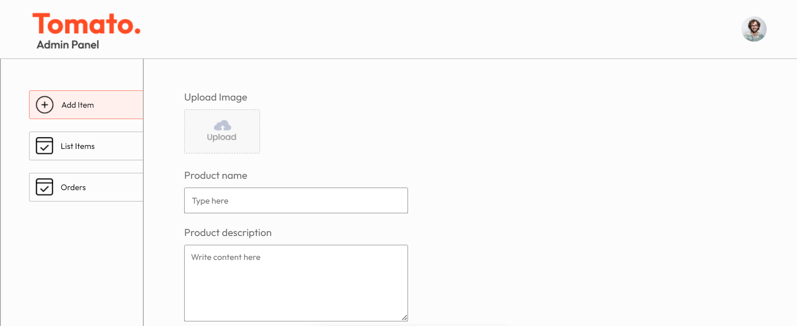

# MERN Food Delivery



This is a full-stack food delivery app built using the MERN stack (MongoDB, Express.js, React.js, Node.js). Users can sign up, log in, and buy food.

## Features

- User authentication: Sign up, log in, log out.
- History : records all purchases.
- Admin can see all orders, products and state of the orders.
- Amin can add new products.
- Responsive design.
- User-friendly interface.

## Technologies Used

- **Frontend:**
  - React.js
  - React Router DOM
  - React Hot Toast (for toast notifications)
  - Axios

- **Backend:**
  - Express.js
  - MongoDB with Mongoose
  - JSON Web Tokens (JWT)
  - Bcryptjs
  - Cors
  - Dotenv
  - Nodemon
  - Multer
  - Validator
  - Stripe

- **Build Tools:**
  - Vite (for frontend build)

- **Development Tools:**
  - ESLint (for linting)
  - eslint-plugin-react and eslint-plugin-react-hooks (for React linting)
  - eslint-plugin-react-refresh (for React refresh linting)
  - @types/react and @types/react-dom (for TypeScript support)
  - @vitejs/plugin-react (for React support in Vite)

## Installation

1. Clone this repository.
2. Navigate to each folder(frontend, backend, admin) directory.
3. Install dependencies using the following command:

```bash
npm install
```

4. Create a .env file in the backend directory and add the environment variables:

```bash
MONGO_DB_URI=
JWT_SECRET=
STRIPE_SECRET_KEY=
```

5. Start the development server:

backend:

```bash
npm run server
```

frontend and admin:

```bash
npm run dev
```

This project was developed by [Javkhlan](https://github.com/Skitarii11) as a Personal project
